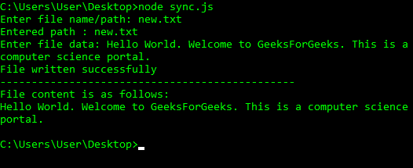
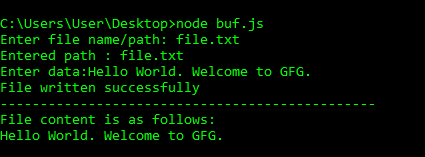

# node . js | fs . writelefilesync()方法

> 原文:[https://www . geesforgeks . org/node-js-fs-write filesync-method/](https://www.geeksforgeeks.org/node-js-fs-writefilesync-method/)

Node.js 的“fs”模块实现了文件的输入输出操作。fs 模块中的方法可以是同步的，也可以是异步的。异步函数有一个回调函数作为指示异步函数完成的最后一个参数。与同步方法相比，Node.js 开发人员更喜欢异步方法，因为异步方法在程序执行过程中从不阻塞程序，而后者会阻塞程序。阻塞主线程是 Node.js 中的弊端，因此同步函数应该只用于调试或者在没有其他选项可用的时候。fs.writeFileSync()是一种同步方法。如果指定的文件不存在，fs.writeFileSync()将创建一个新文件。“readline-sync”模块也用于在运行时启用用户输入。
**语法:**

```js
fs.writeFileSync( file, data, options )
```

**参数:**该方法接受三个参数，如上所述，如下所述:

*   **文件:**它是一个字符串、缓冲区、网址或文件描述整数，表示必须写入的文件路径。使用文件描述符将使其行为类似于 fs.write()方法。
*   **数据:**它是一个字符串、Buffer、TypedArray 或 DataView，将被写入文件。
*   **选项:**它是一个字符串或对象，可用于指定将影响输出的可选参数。它有三个可选参数:
    *   **编码:**是指定文件编码的字符串。默认值为“utf8”。
    *   **模式:**指定文件模式的整数。默认值为 0o666。
    *   **标志:**它是一个字符串，指定写入文件时使用的标志。默认值为“w”。

以下示例说明了 Node.js 中的**fs . writelefilesync()方法**:

**例 1:**

```js
// Node.js program to demonstrate the
// fs.writeFileSync() method

// Import the filesystem module
const fs = require('fs');

let data = "This is a file containing a collection"
           + " of programming languages.\n"
 + "1\. C\n2\. C++\n3\. Python";

fs.writeFileSync("programming.txt", data);
console.log("File written successfully\n");
console.log("The written has the following contents:");
console.log(fs.readFileSync("programming.txt", "utf8"));
```

**输出:**

```js
File written successfully

The written has the following contents:
This is a file containing a collection of programming languages.
1\. C
2\. C++
3\. Python
```

**例 2:**

```js
// Node.js program to demonstrate the
// fs.writeFileSync() method

// Import the filesystem module
const fs = require('fs');

// Writing to the file 5 times
// with the append file mode
for (let i = 0; i < 5; i++) {
  fs.writeFileSync("movies.txt",
    "Movie " + i + "\n",
    {
      encoding: "utf8",
      flag: "a+",
      mode: 0o666
    });
}

console.log("File written successfully 5 times\n");
console.log("The written file has the following contents:");
console.log(fs.readFileSync("movies.txt", "utf8"));
```

**输出:**

```js
File written successfully 5 times

The written file has the following contents:
Movie 0
Movie 1
Movie 2
Movie 3
Movie 4
```

**参考:**T2【https://nodejs . org/API/fs . html # fs _ fs _ writelefilesync _ file _ data _ options

**示例 3:** 使用 readline 模块从用户处获取文件名和文件数据的运行时输入

```js
// Write Javascript code here
var readline = require('readline-sync'); 
var fs = require("fs"); 

var path = readline.question("Enter file name/path: "); 

console.log("Entered path : " + path); 

var data = readline.question("Enter file data: ");

//synchronous functions may throw errors 
//which can be handled using try-catch block
try {
  fs.writeFileSync(path, data,{flag:'a+'});   //'a+' is append mode
  console.log("File written successfully");
} catch(err) {
  console.error(err);
}
console.log("-----------------------------------------------");
try{
const data = fs.readFileSync(path,{encoding: "utf8"}); 
  console.log("File content is as follows:");
  // Display the file data 
  console.log(data); 
}catch(err){
console.log(err);
}
```

**输出**


**示例 4:** 使用缓冲区从用户处获取使用 readline 模块的文件数据的运行时输入

```js
// Write Javascript code here
var fs = require("fs");
var readline = require('readline-sync'); 
var path = readline.question("Enter file name/path: "); 

console.log("Entered path : " + path); 
// 1024 specifies the buffer size. We can limit 
// the data size by this approach
var buf = new Buffer.alloc(1024);
buf = readline.question("Enter data:");

try {
  fs.writeFileSync(path, buf,{flag:'a+'});
  console.log("File written successfully");
} catch(err) {
  console.error(err);
}
console.log("-----------------------------------------------");
try{
const data = fs.readFileSync(path,{encoding: "utf8"}); 
  console.log("File content is as follows:");
  // Display the file data 
  console.log(data); 
}catch(err){
console.log(err);
}
```

**输出**
