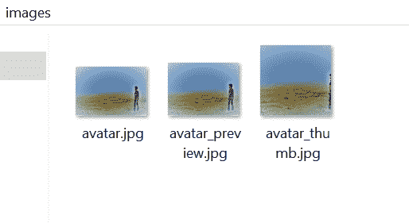

# 使用 Sharp 包进行 Node.js 图像上传、处理和调整大小

> 原文:[https://www . geesforgeks . org/node-js-image-upload-processing-and-size-use-sharp-package/](https://www.geeksforgeeks.org/node-js-image-upload-processing-and-resizing-using-sharp-package/)

通常在我们的 web 应用程序中，我们需要存储多种形式和格式的图像，以电子商务原型中产品的个人资料图片或图像的形式。在大多数情况下，我们需要存储压缩到多种尺寸的图像，以保持质量。例如，对于电子商务网站上的产品，我们需要存储产品映像的 3 个版本:

*   极小的
*   预览分辨率低等。
*   实际产品的原始高分辨率。

**先决条件:**

*   Node.js 基础
*   express.js 中的路线处理

**使用的模块:** [夏普](https://www.npmjs.com/package/sharp)[木特](https://www.npmjs.com/package/multer)

根据官方 npm 文档，sharp 的典型用例是将普通格式的大图像转换为较小的、网络友好的 JPEG、PNG 和不同尺寸的网络图片。

在空目录中初始化 npm，以下面的命令开始:

```
npm init -y
```

使用以下命令安装所需的模块:

```
npm install express --save
npm install body-parser --save
npm install sharp --save
npm install multer --save

```

**Multer 设置:**
要上传文件，我们需要将 Multer 配置为要传递的中间件。为了设置 multer，我们需要在应用程序中添加以下代码。

**注意:**如需了解更多关于上传和 multer 的用法，您可以参考 [Multer](https://www.npmjs.com/package/multer) 的官方文档

```
// Importing the module
const multer = require('multer');  

// Setting up a middleware specifying the
// destination for storing the images
const upload = multer({dest : './images'})   
```

由于 multer 处理表单数据，您需要确保上传是通过配置为多部分/表单数据的表单进行的。

**文件名:app.js**

```
// Importing the required modules
var express = require('express');
var bodyparser = require('body-parser');
var fs = require('fs');
var multer = require('multer');
var sharp = require('sharp');

var upload = multer({dest : './images'}) 

// Initialize the express object
var app = express();     

// Use body-parser to parse incoming data
app.use(bodyparser.urlencoded({extended : true}))     

// Use the upload middleware containing 
// our file configuration, with the name
// of input file attribute as "avatar"
// to the desired configuration.

app.post('/upload', upload.single("avatar"), (req, res)=>
{
    fs.rename(req.file.path, './images/avatar.jpg', (err)=>{
        console.log(err);
    })

    return res.json("File Uploaded Successfully!");
});

app.listen(3000, ()=>{
    console.log("Server Running!")
})
```

**运行上述代码的步骤:**

1.  Run app.js file using the following command:

    ```
    node app.js
    ```

    执行上述命令后，您将看到以下输出:

    ```
    Server Running!
    ```

2.  使用 Postman 向*发送 POST 请求 https://localhost:3000/上传*。你需要通过“头像”作为关键，图片作为价值。
3.  点击请求后，将创建一个包含我们所需图像的图像目录。

**使用夏普处理图像:**我们将通过夏普包处理图像。要创建具有不同属性的多个实例，我们使用以下代码:

```
// Configuring thumbnail image
sharp(__dirname + '/images/avatar.jpg').resize(200,200)
.jpeg({quality : 50}).toFile(__dirname 
        + '/images/avatar_thumb.jpg');

// Configuring Preview Image
sharp(__dirname + '/images/avatar.jpg').resize(640,480)
.jpeg({quality : 80}).toFile(__dirname 
        + '/images/avatar_preview.jpg');
```

所以一切都准备好了，最终 **app.js** 如下:
**文件名:app.js**

```
var express = require('express');
var bodyparser = require('body-parser');
var fs = require('fs');
var multer = require('multer');
var sharp = require('sharp');

var upload = multer({dest : './images'}) 

var app = express();   

app.use(bodyparser.urlencoded({extended : true}))  

app.post('/upload', upload.single("avatar"), (req, res)=>
{
    fs.rename(req.file.path, './images/avatar.jpg', (err)=>{
        console.log(err);
    })

    sharp(__dirname + '/images/avatar.jpg').resize(200,200)
    .jpeg({quality : 50}).toFile(__dirname 
        + '/images/avatar_thumb.jpg');

    sharp(__dirname + '/images/avatar.jpg').resize(640,480)
    .jpeg({quality : 80}).toFile(__dirname 
        + '/images/avatar_preview.jpg');

    return res.json("File Uploaded Successfully!");
});

app.listen(3000, ()=>{
    console.log("Server Running!")
})
```

运行服务器并发送与之前相同的请求后，您将获得图像目录中所有上传的图像，所需配置如下所示:


**附加锐选:***https://sharp.pixelplumbing.com/*