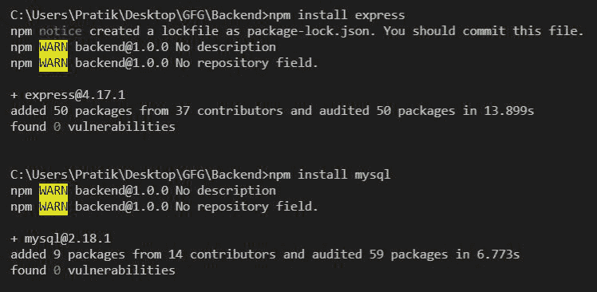

# Node.js MySQL 创建表

> 原文:[https://www.geeksforgeeks.org/node-js-mysql-create-table/](https://www.geeksforgeeks.org/node-js-mysql-create-table/)

**简介:**学习使用 NodeJS 在 MySQL 数据库中创建表。我们将看到如何使用 MySQL 模块在 NodeJS 中使用 Create Table 命令。

**先决条件**:[NodeJS MySQL 简介](https://www.geeksforgeeks.org/nodejs-connect-mysql-with-node-app/)

**设置环境和执行:**

**步骤 1:** 创建一个 NodeJS 项目，并使用以下命令对其进行初始化:

```
npm init
```


**步骤 2:** 使用以下命令安装 **express** 和 **mysql** 模块:

```
npm install express
npm install mysql
```



**文件结构:**我们的文件结构如下图所示:


**示例:**创建并导出 MySQL 连接对象，如下图所示:

**文件名:sqlConnection.js**

## java 描述语言

```
const mysql = require("mysql");

let db_con  = mysql.createConnection({
    host: "localhost",
    user: "root",
    password: '',
    database: 'gfg_db'
});

db_con.connect((err) => {
    if (err) {
      console.log("Database Connection Failed !!!", err);
    } else {
      console.log("connected to Database");
    }
});

module.exports = db_con;
```

**示例 1:** 创建没有主键的表。

## index.js

```
const express = require("express");
const database = require('./sqlConnection');

const app = express();

app.get("/", (req, res) => {

  let tableName = 'gfg_table';

  // Query to create table
  let query = `CREATE TABLE ${tableName} (
    name VARCHAR(255), address VARCHAR(255))`;

  database.query(query, (err, rows) => {
      if(err) return res.status(500)
          .send("Table Creation Failed");

      return res.send(
`Successfully Created Table - ${tableName}`);
  })
});

app.listen(5000, () => {
  console.log(`Server is up and running on 5000 ...`);
});
```

使用以下命令运行 **index.js** 文件:

```
node index.js
```

**输出:**

```
Successfully Created Table - gfg_table
```


**示例 2:** 创建一个带有自动递增主键的表。

## index.js

```
const express = require("express");
const database = require('./sqlConnection');

const app = express();

app.get("/", (req, res) => {

    let tableName = 'gfg_table';

    // Query to create table
    let query = `CREATE TABLE ${tableName} 
        (id INT AUTO_INCREMENT PRIMARY KEY, 
        name VARCHAR(255), address VARCHAR(255))`;

    database.query(query, (err, rows) => {
        if(err) return res.status(500)
            .send("Table Creation Failed");

        return res.send(
`Successfully Created Table - ${tableName}`);
    })
});

app.listen(5000, () => {
  console.log(`Server is up and running on 5000 ...`);
});
```

使用以下命令运行 **index.js** 文件:

```
node index.js
```

**输出:**

```
Successfully Created Table - gfg_table
```

