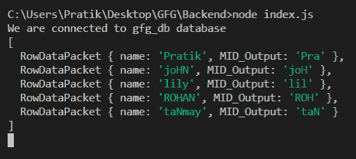

# Node.js MySQL MID()函数

> 原文:[https://www.geeksforgeeks.org/node-js-mysql-mid-function/](https://www.geeksforgeeks.org/node-js-mysql-mid-function/)

**MID()** 函数是 MySQL 中的一个内置函数，用于获取给定范围(含)之间的输入字符串的子串。

**语法:**

```js
MID(input_string, from, length)
```

**参数:** MID()函数接受三个参数，如上所述，如下所述。

*   **输入 _ 字符串:**将计算该输入的子字符串
*   **from:** 子串将取自该位置
*   **长度:**子串长度

**返回值:**

函数的作用是:返回给定起始位置和长度之间的输入字符串的子串。如果长度超出字符串，则忽略多余的部分。

**模块:**

*   **mysql:** 处理 mysql 连接和查询

```js
npm install mysql
```

**SQL 发布者表预览:**


**例 1:**

## java 描述语言

```js
const mysql = require("mysql");

let db_con = mysql.createConnection({
  host: "localhost",
  user: "root",
  password: "",
  database: "gfg_db",
});

db_con.connect((err) => {
  if (err) {
    console.log("Database Connection Failed !!!", err);
    return;
  }

  console.log("We are connected to gfg_db database");

  // notice the ? in query
  let query = `SELECT MID("Geeks For Geeks", 7, 20) AS MID_Output`;

  db_con.query(query, (err, rows) => {
    if (err) throw err;

    console.log(rows);
  });
});
```

**输出:**


**例 2:**

## java 描述语言

```js
const mysql = require("mysql");

let db_con = mysql.createConnection({
  host: "localhost",
  user: "root",
  password: "",
  database: "gfg_db",
});

db_con.connect((err) => {
  if (err) {
    console.log("Database Connection Failed !!!", err);
    return;
  }

  console.log("We are connected to gfg_db database");

  // notice the ? in query
  let query = `SELECT name, MID(name, 1, 3) AS MID_Output FROM publishers`;

  db_con.query(query, (err, rows) => {
    if (err) throw err;

    console.log(rows);
  });
});
```

**输出:**

