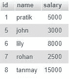

# Node.js MySQL SUM()函数

> 原文:[https://www.geeksforgeeks.org/node-js-mysql-sum-function/](https://www.geeksforgeeks.org/node-js-mysql-sum-function/)

我们使用 MySQL 中的 Sum()函数来获取一些列的值的 SUM。

**语法:**

```js
SUM(column_name)
```

**参数:** SUM()函数接受单个参数，如上所述，如下所述。

*   **列名:**我们必须从中返回最大值的列名。

**模块安装:**使用以下命令安装 **mysql** 模块。

```js
npm install mysql
```

**数据库:**我们的 SQL **发布者** 带有样本数据的表格预览如下所示:



**例 1:**

## index.js

```js
const mysql = require("mysql");

let db_con  = mysql.createConnection({
    host: "localhost",
    user: "root",
    password: '',
    database: 'gfg_db'
});

db_con.on('error', (err) => {
    console.log(err.code);
});

db_con.connect((err) => {
    if (err) {
      console.log("Database Connection Failed !!!", err.code);
      return;
    }

    console.log("We are connected to gfg_db database");

    // Here is the query
    let query = "SELECT SUM(salary) AS total_salary FROM publishers";

    db_con.query(query, (err, rows) => {
        if(err) throw err;

        console.log(rows);
    });
});
```

使用以下命令运行 **index.js** 文件:

```js
node index.js
```

**输出:**


**例 2:**

## index.js

```js
const mysql = require("mysql");

let db_con  = mysql.createConnection({
    host: "localhost",
    user: "root",
    password: '',
    database: 'gfg_db'
});

db_con.on('error', (err) => {
    console.log(err.code);
});

db_con.connect((err) => {
    if (err) {
      console.log("Database Connection Failed !!!", err.code);
      return;
    }

    console.log("We are connected to gfg_db database");

    // Here is the query
    let query = "SELECT SUM(salary) AS total_salary FROM 
                 publishers WHERE id BETWEEN 2 AND 7";

    db_con.query(query, (err, rows) => {
        if(err) throw err;

        console.log(rows);
    });
});
```

使用以下命令运行 **index.js** 文件:

```js
node index.js
```

**输出:**

