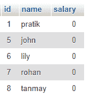
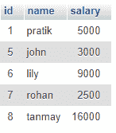

# Node.js MySQL 更新语句

> 原文:[https://www . geesforgeks . org/node-js-MySQL-update-statement/](https://www.geeksforgeeks.org/node-js-mysql-update-statement/)

**Node.js** 是在服务器端执行 JavaScript 代码的开源平台。 可以从 [这里](https://nodejs.org/en/)下载。 **MySQL** 是一个使用结构化查询语言(SQL)的开源关系数据库管理系统(RDBMS)。它是在数据库中添加、访问和管理内容的最流行的语言。这里我们将使用 MySQL 作为节点应用程序的数据库。可以从这里的 [下载。](https://dev.mysql.com/downloads/mysql/5.6.html)

**更新语句:**更新命令是一个 DML 命令，用于操作表的记录。

**语法:**

```
UPDATE [table_name] SET column_A = value_A, 
  column_B = value_B, ... WHERE condition
```

**模块:**

*   mysql: **mysql 模块**用于 mysql 服务器与 node.js 应用的交互。

**安装模块:**

```
npm install mysql
```

**SQL 发布者表预览:**


**例 1:** 将所有薪资更新为 0。

## index.js

```
// Importing module
const mysql = require("mysql");

// Creating connection
let db_con  = mysql.createConnection({
    host: "localhost",
    user: "root",
    password: '',
    database: 'gfg_db'
});

db_con.connect((err) => {
    if (err) {
      console.log("Database Connection Failed !!!", err);
      return;
    }

    console.log("We are connected to gfg_db database");

    // Creating Query
    let query = "UPDATE publishers SET salary=0";

    // Executing Query
    db_con.query(query, (err, rows) => {
        if(err) throw err;
        console.log(rows);
    });
});
```

使用以下命令运行 **index.js** 文件:

```
node index.js
```

**控制台输出:**在 UPDATE 中使用 Where 子句非常重要。否则，整个桌子可能会变得无用。



**例 2:** 收入 7000 以上的出版者加薪 1000。

## index.js

```
// Importing module
const mysql = require("mysql");

// Creating connection
let db_con  = mysql.createConnection({
    host: "localhost",
    user: "root",
    password: '',
    database: 'gfg_db'
});

db_con.connect((err) => {
    if (err) {
      console.log("Database Connection Failed !!!", err);
      return;
    }

    console.log("We are connected to gfg_db database");

    // Generating Query
    let query = 
"UPDATE publishers SET salary=salary+1000 WHERE salary > 7000";

    // Executing Query
    db_con.query(query, (err, rows) => {
        if(err) throw err;

        console.log(rows);
    });
});
```

使用以下命令运行 **index.js** 文件:

```
node index.js
```

**控制台输出:**注意 id 为 6，8 的用户之前和当前的薪资

