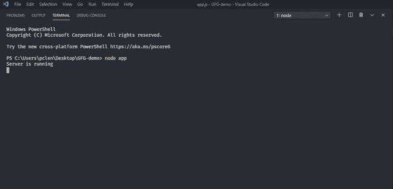
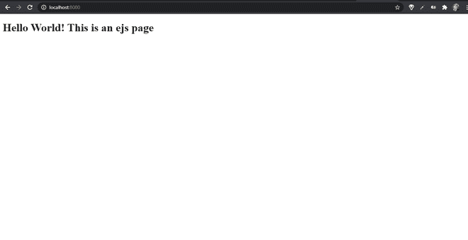

# 使用 EJS

的 Node.js 服务器端渲染(SSR)

> 原文:[https://www . geesforgeks . org/node-js-server-side-rendering-SSR-using-ejs/](https://www.geeksforgeeks.org/node-js-server-side-rendering-ssr-using-ejs/)

***服务器端渲染(SSR)*** 是一种流行的技术，用于在服务器上渲染通常仅客户端的单页应用程序(SPA)，然后向客户端发送完全渲染的页面。客户端的 JavaScript 包可以接管，SPA 可以正常运行。

SSR 技术在以下情况下很有用:客户端的互联网连接速度很慢，然后在客户端呈现整个页面需要花费太多时间；在某些情况下，服务器端呈现可能会派上用场。EJS 模块是 Node.js 中广泛使用的服务器端渲染模块之一。EJS 代表**嵌入式 JavaScript 模板。**

**EJS 模块特点:**

1.  使用普通的 javascript。
2.  开发时间快。
3.  简单的语法。
4.  更快的执行。
5.  易于调试。
6.  积极发展。

**安装请求模块:**

1.  首先使用 npm install 安装 express js 和 ejs。您也可以访问[这个链接](https://www.npmjs.com/package/ejs)来了解更多关于 EJS 的信息。

    ```js
    npm install ejs
    ```

2.  require()方法用于加载和缓存 JavaScript 模块。

    ```js
    const ejs = require('ejs');
    ```

3.  下一步是创建一个文件夹，并添加一个文件名 app.js 和一个名为 index.ejs 的文件。注意，关于索引文件的语法，这里是 ejs，表示它是一个 ejs 文件。要运行此文件，您需要以下命令。

```js
node app.js
```

**使用 EJS renderFIle()方法渲染文件**
要执行服务器端渲染，我们使用 EJS 模块的 Render file()方法，该方法帮助我们在服务器端渲染 ejs 文件。

**语法:**

```js
ejs.renderFile( fileName, { }, { }, callback);
```

这里，回调函数接受两个参数:首先是一个错误(如果出现错误，renderFile 将返回一个错误)，成功呈现后，它将返回一个模板。

**文件名:app.js**

```js
// Requiring modules
const express = require('express');
const app = express();
const ejs = require('ejs');
var fs = require('fs');
const port = 8000;

// Render index.ejs file
app.get('/', function (req, res) {

    // Render page using renderFile method
    ejs.renderFile('index.ejs', {}, 
        {}, function (err, template) {
        if (err) {
            throw err;
        } else {
            res.end(template);
        }
    });
});

// Server setup
app.listen(port, function (error) {
    if (error)
        throw error;
    else
        console.log("Server is running");
});
```

**档案名称:index.ejs**

```js
<!DOCTYPE html>
<html lang="en">

<head>
    <meta charset="UTF-8">
    <meta name="viewport" content=
        "width=device-width, initial-scale=1.0">
</head>

<body>
    <h1>Hello World</h1>
</body>

</html>
```

**运行程序的步骤:**

1.  **文件夹结构:**
    
2.  确保您已经使用以下命令安装了快速和请求模块:

    ```js
    npm install express
    npm install ejs
    ```

3.  Run **app.js** using below command:

    ```js
    node app.js
    ```

    

    启动节点服务器

4.  现在在浏览器中输入 *localhost:8000* 显示 ejs 页面看到如下结果:
    

    浏览器中的结果