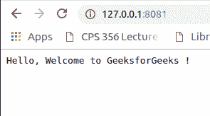

# 节点

中的服务器、流和套接字

> 原文:[https://www . geesforgeks . org/servers-streams-and-socket-in-node/](https://www.geeksforgeeks.org/servers-streams-and-sockets-in-node/)

## **Node.js 服务器**

Node.js 是一个用于编写服务器端应用程序的 javascript 框架。
node . js 服务器提供了连接到服务和发送/接收数据的机制。它通过 TCP 或 UDP 连接来实现这一点。因此，开发人员可以创建自己的服务器并测试他们的应用程序部署。
NodeJS 自带一个简单的 HTTP 服务器内置。这个 HTTP 服务器允许我们监听任意端口(由我们指定)，并通过回调函数接收回调，每次向服务器发出请求时都会调用回调函数。
回调将接收两个参数:一个请求对象和一个响应对象。请求对象将填充关于请求的有用属性，响应对象将用于向客户端发送响应。

#### 一旦你安装了节点，让我们尝试建立我们的第一个网络服务器。例如，让我们编写一个 server.js 文件-

```js
const http = require('http');

const hostname = '127.0.0.1';
const port = 8081;

const server = http.createServer((req, res) => {
  res.statusCode = 200;
  res.setHeader('Content-Type', 'text/plain');
  res.end('Hello, Welcome to GeeksforGeeks !\n');
});

server.listen(port, hostname, () => {
  console.log(`Your Node.js server is running at http://${hostname}:${port}/`);
});
```

现在要从终端执行这个文件，只需写:-

```js
node server.js
```

你会看到:


导航到指定的 url 后，将打开一个简单的 HTML 页面，显示:



因此，我们创建了一个监听端口 8081 的本地 Node.js 网络服务器。

## **Node.js 流**

流是数据的集合，就像数组或字符串一样。流是一个抽象接口，用于在 Node.js 中处理流数据。流模块提供了一个基本的应用编程接口，使得构建实现流接口的对象变得容易。在 Node.js 中，有四种类型的流–

**Writable** 

**Readable** 

**Duplex** 

**Transform** 

使用 Node.js 流，我们可以修改和转换数据。

#### 使用流读取文件

创建包含任意内容的文本文件。例如–node . txt，内容如下-

```js
Welcome to Nodejs streams usage. Read this file.

```

创建一个 js 文件，例如- read.js，包含以下内容-

```js
var fs = require("fs"); //using the Node fs module you can read a file
var data = '';

// Create a read stream with your text file name in quotes (Node.txt)
var readerStream = fs.createReadStream('Node.txt'); 

readerStream.setEncoding('UTF8');

//Stream events-
//'data','end','error'----see details at 
https://nodejs.org/api/stream.html#stream_class_stream_readable

readerStream.on('data', function(chunk) {
   data += chunk;
});

readerStream.on('end',function() {
   console.log(data);
});

readerStream.on('error', function(err) {
   console.log(err.stack);
});

console.log("Reading complete");
```

现在运行上面的 read.js 文件查看输出-


#### 使用流写入文件

创建一个 js 文件，例如- write.js，内容如下-

```js
var fs = require("fs");

//data variable containing the data to be written to the file
var data = 'Hello welcome to Node.js tutorials on GeeksforGeeks'; 

// Create a writable stream with the output file name in quotes (Node1.txt)
var writerStream = fs.createWriteStream('Node1.txt');

// utf8 encoding
writerStream.write(data,'UTF8');

//end of file
writerStream.end();

// Handle stream events --> finish, and error
writerStream.on('finish', function() {
   console.log("Write completed.");
});

writerStream.on('error', function(err) {
   console.log(err.stack);
});

console.log("You've successfully created Node1.txt");
```

执行以上文件-


文本文件已经创建。要检查-


## **Node.js 插座**

这里我们说的是 Node.js 的“网”模块，而不是 Socket。IO-支持浏览器和服务器之间实时、双向和基于事件的通信的库。

net 模块为创建基于流的 TCP 或 IPC 服务器(net.createServer())和客户端(net.createConnection())提供了异步网络应用编程接口。

“网。套接字”是一个类，它是 TCP 套接字或流式 IPC 端点的抽象，也是一个双工流，因此它可以用于读取和写入数据。

一张网。套接字可以由用户创建，并直接用于与服务器交互。例如，它由 net.createConnection()返回，因此用户可以使用它与服务器进行对话。

它也可以由 Node.js 创建，并在收到连接时传递给用户。例如，它被传递给网络上发出的“连接”事件的侦听器。服务器，因此用户可以使用它与客户端进行交互。

例如要在 Node.js 中创建一个测试套接字，创建一个文件，例如- test.js，内容如下-

```js
// server
require('net').createServer(function (socket) {
    console.log("connected");

    socket.on('data', function (data) {
        console.log(data.toString());
    });
})

.listen(8082);

// client
var s = require('net').Socket();
s.connect(8082);
s.write('Hello');
s.end();
```

运行上述文件会创建一个客户机-服务器模型，并返回-


净。Socket 有很多功能和事件，比如-

**事件:【关闭】-**
添加于:v0.1.90
如果插座有传输错误，则错误为真。
插座完全关闭时发出。参数 hadError 是一个布尔值，表示套接字是否由于传输错误而关闭。

**事件:【连接】-**
添加于:v0.1.90
当成功建立插座连接时发出。请参见 net.createConnection()。

**socket . address()[src]-**
添加于:v0.1.90
返回:
返回操作系统报告的套接字的绑定地址、地址家族名称和端口:{端口:12346，家族:“IPv4”，地址:“127 . 0 . 0 . 1”}

**socket.bytesRead-**
添加入:v0.5.3
接收的字节量。

**socket . bytes writed-**
添加于:v0.5.3
发送的字节数。

在参考资料中提到的 Node.js 的官方文档中可以进一步探索。

## **参考文献**

1.)https://nodejs . org/API/
2。)https://nodejs.org/en/docs/