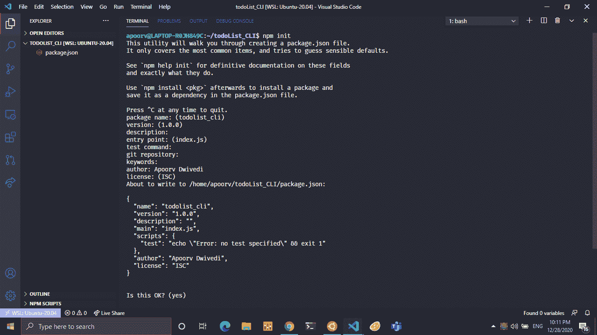

# 使用 Node.js 的待办事项 CLI 应用程序

> 原文:[https://www . geesforgeks . org/todo-list-CLI-application-use-node-js/](https://www.geeksforgeeks.org/todo-list-cli-application-using-node-js/)

**CLI** 对于开发者来说是一个非常强大的工具。我们将学习如何为命令行创建一个简单的待办事项列表应用程序。我们已经将 TodoList 视为网络开发和安卓开发的初学者项目，但命令行界面应用程序我们并不经常听说。

**先决条件:**

*   下载并安装了 Node.js 的最新版本。
*   文本编辑器，例如，VSCode、atom 等。
*   应该安装 NPM。
*   对 JavaScript、es6 特性等有基本了解。

通过 **mkdir < dir-name >** 创建一个新目录，并通过 **cd** 在目录中启动一个空节点项目，并键入命令 **npm init。**



**注:**本项目不使用任何第三方模块。

**项目目录:**现在项目目录应该由两个文件组成，package.json 和 index.js，如下图所示:


我们的待办事项应用程序中的一些基本功能如下:


### **实施:**

创建一个 ***index.js*** 文件，并在其中写下以下代码

## java 描述语言

```js
// Requiring module
const fs = require('fs');

// Accessing arguments
const args = process.argv;

// The "index.js" is 8 characters long 
// so -8 removes last 8 characters
const currentWorkingDirectory = args[1].slice(0, -8);
```

**说明:**我们将在一个名为*的文件中写入待办任务，当这些任务完成时，它们将从 ***中删除，并被写入 ***done.txt*** 中。该报告将显示有多少待办事项已经完成，还有多少剩余。首先，我们将导入**文件系统模块**，这将使我们能够访问文件系统。****

然后，我们将使用 **process.argv** 获得传递的参数，并将它们存储在名为 **args** 的变量中。 **process.argv** 返回一个数组，其中包含节点模块的位置、当前工作目录以及传递的其他参数。我们将通过删除文件名来检索 **cwd** 。

接下来，我们将检查 cwd 中是否已经存在 ***todo.txt*** 和 ***done.txt*** ，如果不存在，我们将创建它们，如下所示:

## java 描述语言

```js
if (fs.existsSync(currentWorkingDirectory + 'todo.txt') === false) {
  let createStream = fs.createWriteStream('todo.txt');
  createStream.end();
}
if (fs.existsSync(currentWorkingDirectory + 'done.txt') === false) {
  let createStream = fs.createWriteStream('done.txt');
  createStream.end();
}
```

现在我们将创建不同的功能来显示用法、添加待办事项、删除待办事项等。将根据传递的参数调用它们。

**信息功能:**显示使用格式。当帮助作为参数传递或没有参数传递时，将调用它。

## java 描述语言

```js
const InfoFunction = () => {
  const UsageText = `
Usage :-
$ node index.js add "todo item"  # Add a new todo
$ node index.js ls               # Show remaining todos
$ node index.js del NUMBER       # Delete a todo
$ node index.js done NUMBER      # Complete a todo
$ node index.js help             # Show usage
$ node index.js report           # Statistics`;

  console.log(UsageText);
};
```

**列表功能:**它会从 todo.txt 中读取数据，并用相应的数字显示出来。最近显示在顶部，数字最大。

## java 描述语言

```js
const listFunction = () => {

  // Create a empty array
  let data = []; 

  // Read from todo.txt and convert it
  // into a string
  const fileData = fs.readFileSync(
    currentWorkingDirectory + 'todo.txt')
  .toString(); 

  // Split the string and store into array
  data = fileData.split('\n'); 

  // Filter the string for any empty lines in the file
  let filterData = data.filter(function (value) {
    return value !== '';
  }); 

  if (filterData.length === 0) {
    console.log('There are no pending todos!');
  }

  for (let i = 0; i < filterData.length; i++) {
    console.log((filterData.length - i) + '. ' 
    + filterData[i]);
  }
};
```

**添加函数:**它会从 todo.txt 中读取内容，添加新的 todo，然后在 todo.txt 中重写。

**注意:**由于我们在 JavaScript 中写入和读取文件时没有设置文件中指针位置的功能，所以每次添加新数据时，我们都必须读取数据，进行修改，然后重新写回。

## java 描述语言

```js
const addFunction = () => {

  // New todo string argument is stored
  const newTask = args[3]; 

  // If argument is passed
  if (newTask) { 

    // Create a empty array
    let data = []; 

    // Read the data from file todo.txt and 
    // convert it in string
    const fileData = fs
      .readFileSync(currentWorkingDirectory + 'todo.txt')
      .toString(); 

    // New task is added to previous data  
    fs.writeFile(
      currentWorkingDirectory + 'todo.txt',
      newTask + '\n' + fileData, 

      function (err) {

        // Handle if there is any error
        if (err) throw err; 

        // Logs the new task added
        console.log('Added todo: "' + newTask + '"'); 
      },
    );
  } else { 

    // If argument was no passed
    console.log('Error: Missing todo string. Nothing added!');
  }
};
```