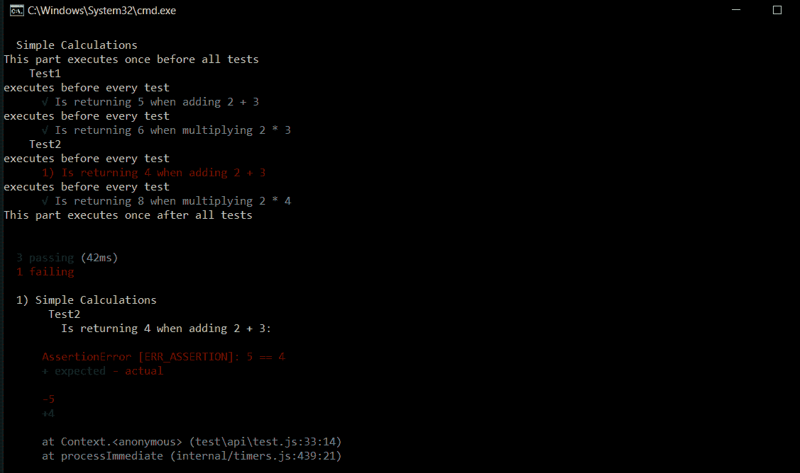
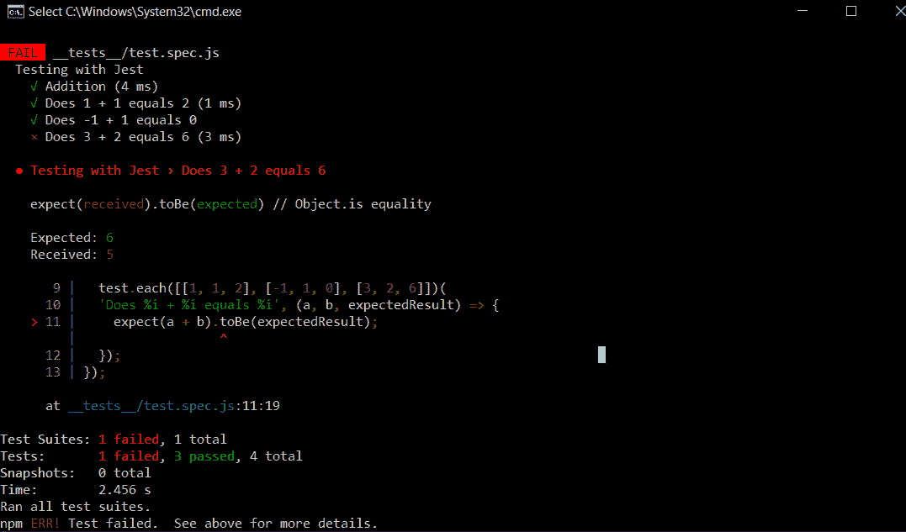

# node . js 应用的单元测试

> 原文:[https://www . geesforgeks . org/unit-testing-of-node-js-application/](https://www.geeksforgeeks.org/unit-testing-of-node-js-application/)

Node.js 是一个广泛使用的 javascript 库，基于 Chrome 的 V8 JavaScript 引擎，用于开发 web 开发中的服务器端应用程序。

[单元测试](https://www.geeksforgeeks.org/unit-testing-software-testing/)是对单个单元/组件进行隔离测试的软件测试方法。一个单元可以被描述为应用程序中最小的可测试代码部分。单元测试通常由开发人员在应用程序的开发阶段进行。

在 Node.js 中，有许多运行单元测试的框架。其中一些是:

*   摩卡
*   玩笑
*   茉莉
*   自动话频警报器(automatic voice alarm)ˌ视听教具(audiovisual aids)

**使用这些框架对节点应用程序进行单元测试:**

1.  **Mocha:** Mocha is an old and widely used testing framework for node applications. It supports asynchronous operations like callbacks, promises, and async/await. It is a highly extensible and customizable framework that supports different assertions and mocking libraries.

    要安装它，请打开命令提示符并键入以下命令:

    ```
    # Installs globally
    npm install mocha -g

    # installs in the current directory
    npm install mocha --save-dev

    ```

    **摩卡怎么用？**
    为了在你的应用中使用这个框架:

    1.  打开项目的根文件夹，在里面新建一个名为 **test** 的文件夹。
    2.  在 test 文件夹中，创建一个名为 test.js 的新文件，其中包含所有与测试相关的代码。
    3.  打开 package.json 并在 scripts 块中添加以下行。

        ```
        "scripts": {
        "test": "mocha --recursive --exit"
        }
        ```

    **示例:**

    ```
    // Requiring module
    const assert = require('assert');

    // We can group similar tests inside a describe block
    describe("Simple Calculations", () => {
      before(() => {
        console.log( "This part executes once before all tests" );
      });

      after(() => {
        console.log( "This part executes once after all tests" );
      });

      // We can add nested blocks for different tests
      describe( "Test1", () => {
        beforeEach(() => {
          console.log( "executes before every test" );
        });

        it("Is returning 5 when adding 2 + 3", () => {
          assert.equal(2 + 3, 5);
        });

        it("Is returning 6 when multiplying 2 * 3", () => {
          assert.equal(2*3, 6);
        });
      });

      describe("Test2", () => {
        beforeEach(() => {
          console.log( "executes before every test" );
        });

        it("Is returning 4 when adding 2 + 3", () => {
          assert.equal(2 + 3, 4);
        });

        it("Is returning 8 when multiplying 2 * 4", () => {
          assert.equal(2*4, 8);
        });
      });
    });
    ```

    复制上面的代码并粘贴到我们之前创建的 test.js 文件中。要运行这些测试，请在项目的根目录中打开命令提示符，并键入以下命令:

    ```
    npm run test
    ```

    **输出:**

    

    **柴是什么？**
    柴是一个经常和摩卡一起使用的断言库。它可以用作 Node.js 的 TTD(测试驱动开发)/ BDD(行为驱动开发)断言库，可以与任何基于 JavaScript 的测试框架配对。类似于上面代码中的 assert.equal()语句，我们可以用柴来写类似英语句子的测试。

    要安装它，请在项目的根目录中打开命令提示符，并键入以下命令:

    ```
    npm install chai
    ```

    **示例:**

    ```
    const expect = require('chai').expect;

    describe("Testing with chai", () => {
        it("Is returning 4 when adding 2 + 2", () => {
          expect(2 + 2).to.equal(4);
        });

        it("Is returning boolean value as true", () => {
          expect(5 == 5).to.be.true;
        });

        it("Are both the sentences matching", () => {
          expect("This is working").to.equal('This is working');
        });
     });
    ```

    **输出:**

    

2.  **Jest:** Jest is also a popular testing framework that is known for its simplicity. It is developed and maintained regularly by Facebook. One of the key features of jest is it is well documented, and it supports parallel test running i.e. each test will run in their own processes to maximize performance. It also includes several features like test watching, coverage, and snapshots.

    您可以使用以下命令安装它:

    ```
    npm install --save-dev jest
    ```

    **注意:**默认情况下，Jest 期望在根文件夹中找到名为“ **__tests__** ”的文件夹中的所有测试文件。

    **示例:**

    ```
    describe("Testing with Jest", () => {
      test("Addition", () => {
        const sum = 2 + 3;
        const expectedResult = 5;
        expect(sum).toEqual(expectedResult);
      });

      // Jest also allows a test to run multiple
      // times using different values
      test.each([[1, 1, 2], [-1, 1, 0], [3, 2, 6]])(
      'Does %i + %i equals %i', (a, b, expectedResult) => {
        expect(a + b).toBe(expectedResult);
      });
    });
    ```

    **输出:**

    

3.  **Jasmine:** Jasmine is also a powerful testing framework and has been around since 2010\. It is a [Behaviour Driven Development](https://en.wikipedia.org/wiki/Behavior-driven_development)(BDD) framework for testing JavaScript code. It is known for its compatibility and flexibility with other testing frameworks like Sinon and Chai. Here test files must have a specific suffix (*spec.js).

    您可以使用以下命令安装它:

    ```
    npm install jasmine-node
    ```

    **示例:**

    ```
    describe("Test", function() {
      it("Addition", function() {
        var sum = 2 + 3;
        expect(sum).toEqual(5);
      });
    });
    ```

4.  **AVA:** AVA is a relatively new minimalistic framework that allows you to run your JavaScript tests concurrently. Like the Jest framework, it also supports snapshots and parallel processing which makes it relatively fast compared to other frameworks. The key features include having no implicit globals and built-in support for asynchronous functions.

    您可以使用以下命令安装它:

    ```
    npm init ava
    ```

    **示例:**

    ```
    import test from 'ava';

    test('Addition', t => {
      t.is(2 + 3, 5);
    });
    ```