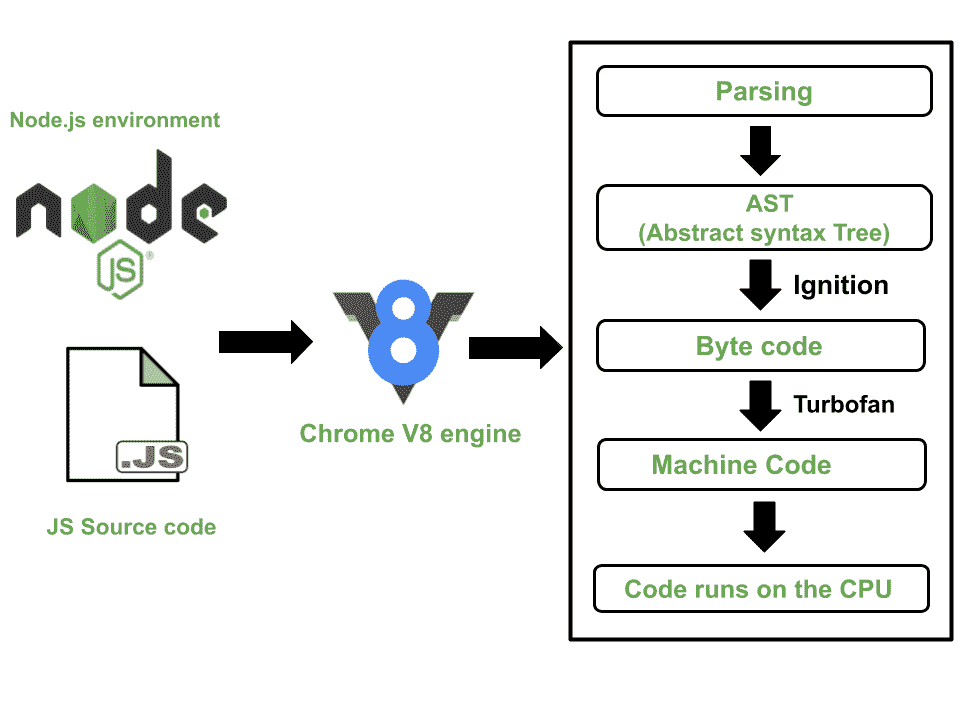
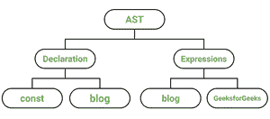

# node . js 和 V8 是什么关系？

> 原文:[https://www . geesforgeks . org/node-js-and-V8 之间的关系是什么/](https://www.geeksforgeeks.org/what-is-the-relationship-between-node-js-and-v8/)

Node.js 是一个开源的、跨平台的、后端的 JavaScript 运行时环境，构建在 V8 引擎之上，在浏览器之外执行 Javascript 代码。Javascript 运行时环境包含执行 JS 代码所需的所有组件。JavaScript 最初被设计成只在浏览器中运行。所有浏览器都配备了运行 JavaScript 的 JavaScript 引擎。*例如，Mozilla Firefox 是由 Spidermonkey 提供动力，而 Chrome 使用的是 V8 引擎。* JavaScript 引擎不是机器，而是执行 JavaScript 代码并使计算机能够在硬件级别执行特定任务的程序或解释器。Ryan Dahl 在 Chrome 浏览器中意识到 V8 引擎的潜力，并将其扩展为作为独立应用程序运行时，创建了 Node.js。计算机只能解释机器码，而 Javascript 是高级语言，所以我们需要一个编译器把 Javascript 翻译成机器码。Node.js 只是一个支持程序执行的运行时环境。 **V8 是 node . js**的核心

没有 V8，Node.js 无法运行。因为没有 JavaScript 引擎，所以没有 JS 可以在这样的环境中运行。Chrome V8 引擎采用人类可读的 Javascript 代码，并将其翻译成更优化的机器代码。它是一个用 C++编写的开源多线程程序。该引擎最初是专为网络浏览器执行而设计的，但最新版本也在浏览器之外执行 JS 代码，从而支持服务器端脚本。它独立于执行它的浏览器。这个特性激发了设计者选择 V8 引擎来为 Node.js 提供动力。V8 引擎嵌入在 node.js 代码中，这为代码增加了额外的特性。因此，C++代码比 ECMAScript 标准规定的要理解得多。V8 引擎和 node.js 是可互操作的。它们共同构成了开发应用程序的强大组合。**V8 发动机是 Node.js.** 的心脏

**V8 引擎的工作:** Js 引擎是较早的解释器，逐行执行代码，不需要编译，使得过程非常缓慢，因为每个语句在执行之前都会被分析以执行期望的任务。随着 V8 的出现，它通过使用单独的线程来加速编译过程，从而解决了这个问题。V8 采用了**准时制**编译器的技术。即时编译器结合了解释器和编译器的最佳特性，使得翻译和执行都更快。解释器逐行执行代码，编译后的代码在运行时被动态地优化(和重新优化)。现在，问题是 Javascript 是解释语言还是编译语言。Javascript 可以是解释语言，也可以是编译语言，这取决于 JS 引擎。

V8 使用以下线程。

**1。main Thread:**FETCH 线程执行获取代码并确保其被编译和执行的主要任务。

**2。编译器线程:**以前版本的 V8 使用两个线程进行编译。

*   **Full-codegen:**这将 JS 编译成简单且相对较慢的机器代码。使用全代码生成器，解析后的 JavaScript 无需任何转换就可以直接翻译成机器代码。因此，执行机器代码非常快。
*   **曲轴:**它编译多次运行的代码段，通常称为热段，最佳情况下，下次当这部分代码被命中时，可以更有效地执行它们。

这个线程经历了某些优化。

*   **内联:**用函数的代码替换函数的调用，从而提高性能。
*   **隐藏类:** JavaScript 是一种动态语言，因此属性可以轻松添加或删除。跟踪每个属性变得昂贵，因此，它使用隐藏类的方法。添加新属性时，新隐藏类的转换路径会添加到每个对象的旧隐藏类中。
*   **内联缓存:** V8 维护在最近的方法调用中作为参数传递的对象类型的缓存，并使用该数据来猜测未来将传递什么类型的对象。

**3。探查器线程**:通知运行时哪些方法占用了我们大部分的时间，因此曲轴可以优化它们

**4。** **垃圾线程**:使用[标记和清除算法](https://www.geeksforgeeks.org/mark-and-sweep-garbage-collection-algorithm/)释放内存管理空间。

让我们看看 V8 引擎如何执行在 Node.js 中编写的 JS 代码



**在 node.js 中执行 Javascript**

**1。解析:** Javascript 源代码被解析并转换为抽象语法树(AST)。代码被分解成标记。令牌是我们代码的构造块，任何组成代码的东西。例如，让 a = 5。这里，字母 a，=，5 是代币。

```
let a = 5 
```

Ast 在程序的语义分析中起着至关重要的作用，因为编译器会验证应用程序和语言元素的正确性和正确使用。

**让我们通过下面的例子来看看 AST 的表示:**

```
const blog = "GeeksforGeeks"
```



**AST 表示**

**JSON 中的 AST 表示**

```
{
  "type": "Program",
  "start": 0,
  "end": 28,
  "body": [
    {
      "type": "VariableDeclaration",
      "start": 0,
      "end": 28,
      "declarations": [
        {
          "type": "VariableDeclarator",
          "start": 6,
          "end": 28,
          "id": {
            "type": "Identifier",
            "start": 6,
            "end": 10,
            "name": "blog"
          },
          "init": {
            "type": "Literal",
            "start": 13,
            "end": 28,
            "value": "GeeksforGeeks",
            "raw": "\"GeeksforGeeks\""
          }
        }
      ],
      "kind": "const"
    }
  ],
  "sourceType": "module"
}
```

**2。编译**:点火从语法树中生成一个中间代码，叫做字节码。

**3。执行**:涡扇将这个字节码转换成高度优化的机器码。机器代码在系统上运行。

*所以，我们已经了解了 Node.js 和 V8 引擎之间的关系，并得出结论，没有 V8 这样的 JavaScript 引擎，是不可能运行 Node.js 的。*