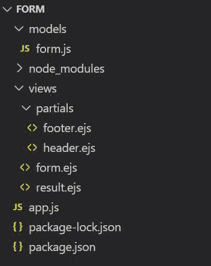
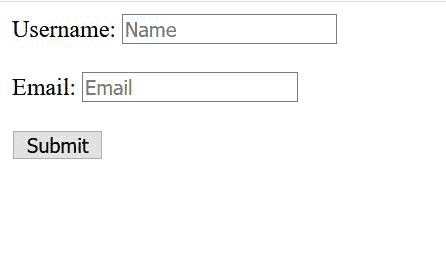
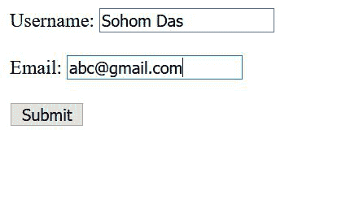

# 在 Node.js 中使用 Express.js 处理表单

> 原文:[https://www . geesforgeks . org/working-with-forms-use-express-js-in-node-js/](https://www.geeksforgeeks.org/working-with-forms-using-express-js-in-node-js/)

在本文中，我们将在 NodeJS 中使用 ExpressJS 处理表单。

使用 Node.js 中的服务器端编程，我们可以创建表单，在其中我们可以放置某些参数，这些参数在填充后会存储在数据库中。

**设置环境:**

你可以参考[这个](https://nodejs.org/en/download/)网站下载 Node.js。除此之外，我们还必须记住，我们正在处理一些涉及**存储数据**的事情。为此，我们需要能够存储从用户终端提交的信息的东西。

我们将使用 MongoDB 来存储表单中提交的数据。在继续下一步之前，我们应该在设备中预先安装 MongoDB。

下载 MongoDB 可以参考[这个](https://www.mongodb.com/try/download/community)网站。

下载 MongoDB 后，在进行上述实现之前，我们必须遵循一些步骤:

```
Run "mongod" command at first.
Press 'ctrl+c' and write 'echo "mongod --nojournal" > mongod'
Write 'chmod a+x mongod'
```

**现在，设置 npm 包:**

```
npm init -y
```

**安装依赖项:**

在终端中使用以下命令立即安装软件包:

```
npm install express body-parser mongoose ejs --save
```

**文件夹结构:**



现在让我们进入代码部分。

## App.js

```
//importing dependencies
const express = require("express")
const app=express();
var mongoose=require("mongoose");
var bodyParser=require("body-parser");

// Calling form.js from models
var Form=require("./models/form");

// Connecting to database
mongoose.connect("mongodb://localhost/form",{
    useNewUrlParser: true,
    useUnifiedTopology: true
});

//middlewares
app.set('view engine','ejs');
app.use(bodyParser.urlencoded({extended:true}));

//rendering form.ejs
app.get("/",function(req,res){
    res.render("form");
});

// form submission
app.get('/result',(req,res)=>{
    res.render('result');
});

//creating form
app.post("/",function(req,res){
    var username=req.body.username;
    var email=req.body.email;
    var f={username: username,email:email};
    Form.create(f,function(err,newlyCreatedForm){
        if(err)
        {
            console.log(err);
        }else{
            res.redirect("/result");
        }
    });
});

// Starting the server at port 3000
app.listen(3000, function() { 
    console.log('Server running on port 3000'); 
});
```

## Form.js

```
//Requiring mongoose package
var mongoose=require("mongoose");

// Schema
var formSchema=new mongoose.Schema({
    username : String,
    email    : String
});

module.exports=mongoose.model("Form",formSchema);
```

## 头儿

```
<!DOCTYPE html>
<!-- Opening HTML Tags-->
<html>
    <!-- Opening head Tags-->
<head>
    <!-- Opening head Tags-->
    <title>Form</title>
</head>
<!-- Opening body Tag -->
<body>
```

## 我的天啊

```
<!--Opening the ejs tags for including header file-->
<%- include("./partials/header") %>
<!-- Creating a form where action will 
    be on "/" and the method will be "POST" -->
<form action="/" method="POST">
    <!-- Creating the parameter Username as type= "text"-->
    <label>Username: </label>
    <input type="text" placeholder="Name" name="username"><br><br>
    <!-- Creating the parameter Email as type= "text"-->
    <label>Email: </label>
    <input type="email" placeholder="Email" name="email"><br><br>
    <!-- Creating the submit button -->
    <button>Submit</button>
</form>
<!--Opening the ejs tags for including footer file-->
<%- include("./partials/footer") %>
```

**输出:**



**填写表格时:**



点击提交按钮，我们被重定向到/result 路由。


**蒙哥贝壳:**


*我们可以看到表单提交的信息存储在数据库中。这就是表单在节点 js 中的工作方式。*